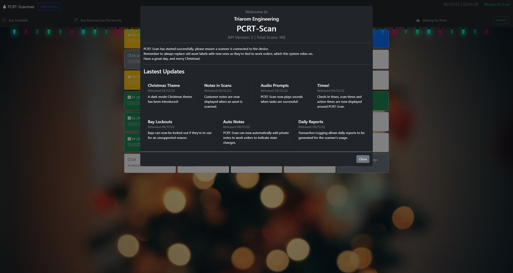

# PCRT Asset Scan System (PCRT-Scan)



This tool automates asset tracking for work orders within [PC Repair Tracker](http://pcrepairtracker.com/).

It's main purpose is to ensure the status of work orders is kept as up-to-date as possible, which reduces
the number of lost assets, and allows anyone to see the status of a device, and it's exact location.

**Disclaimer**: PCRT-Scan is highly specialised to use at Triarom, it is not guaranteed to work with all versions of PCRT, some parts of the system are hard-coded to work as we need, we're slowly converting these to be configured in config.yaml, but there is still work to do.


## Features

This is a brief overview of PCRT-Scan's capabilities, many of the features are configurable and come disabled out-of-the-box.

- Asset Label Scanning - [PCRT Config/Asset Labels](###asset-labels)
- Automatic Bay Assignment - [PCRT Config/Storage Bays](###storage-bays)
- Modular-ish design - [System Overview](##system-overview)
- Custom PCRT States - [PCRT Config/States](###work-order-states)
- Different Storage Bay Types
- Bay Lockouts - [PCRT-Scan Options/Lockouts](###lockouts)
- Transaction Logging - [PCRT-Scan Options/Transaction Logging](###transaction-logging)
- Automatic Note Creation - [PCRT-Scan Options/Automatic Notes](###automatic-notes)
- Daily Usage Reporting - [PCRT-Scan Options/Transaction Logging](###transaction-logging)
- Bay Reassignment - [System Overview](##system-overview)
- Storage Overview Grid - [System Overview](##system-overview)
- Automatic Storage Clash Detection
- Scanner Status Reporting

... and more!

## System Overview

PCRT-Scan aims to reduce the number of lost assets by making it easier for engineers to update the status of jobs within PC Repair Tracker. It does this by using the asset labels attached to customer assets to move devices between the repair shop's storage room and benches. 

A terminal for PCRT-Scan is expected to be placed between the storage room and engineering centre, ensuring engineers pass it, the system is designed to be simple to use so engineers are more inclined to use it.

PCRT-Scan is built in a semi-modular fashion, and is made up of three important sections.

### PCRT-Scan Server
The server can either run on the terminal computer, or on a remote machine (including the PCRT server itself.)

The PCRT-Scan server is responsible for communcation between the frontend, scanner agents and the PCRT database itself. Note that PCRT-Scan communicates directly with the PCRT MySQL database, rather than the PCRT API. Future versions may support the PCRT API, but this requires more maintenance to support future versions of PCRT.

Server presents two Socket.IO sockets to the network or loopback, which scanner agents and frontends can connect to. The ports these listen on can be configured in config.yaml.

### Scanner Agents
Scanner agents are responsible for bridging the gap between a physical scanner device and PCRT-Scan Server. They run on the terminal computer and connect over the loopback or your physical network to communicate with Server.

Provided is com-scanner-agent, a simple agent that connects to serial-based scanners. We use an Eyoyo scanner for testing and in production, it must be used to USB-COM mode by scanning a QR code found in the manual. This is the same for many scanners.

Some scanners, however, will not work with com-scanner-agent and will need a new agent. Documentation will be written on implementing scanner agents, and new ones can be merged in via pull request.

For a guide on configuring com-scanner-agent, see [PCRT-Scan Options/com-scanner-agent](###com-scanner-agent)

Note: only one scanner agent can connect to the server at one time, this may change in the future.

### Frontends
Frontends connect to the PCRT-Scan server via the frontend socket and is sent information from successful scans, the frontend should also be able to send "PCRT Actions". Provided is a simple Bootstrap-based web frontend, a newer version is planned, but this one work for PCRT-Scan API 2. Other frontends (such as a Windows C# version) are also planned.

Multiple frontends can connect to Server at the same time, though we don't often test it in this scenario. Further updates to multi-frontend support are planned.

### Example Sequence of Operation

```sequence
                                                                [ PCRT MySQL Database ]
                                                                          ^
                                                                          |
                                                                          |
QR Code Scanned -> [com-scanner-agent] --(scanner-agent-socket)--> [pcrt-scan server] --(frontend socket)--> [Bootstrap Frontend]

Action Selected by Technician -> [frontend] -> [pcrt-scan server] -> [PCRT MySQL Database] -> [pcrt-scan server] -> [frontend] -> Action confirmation.
```

### PCRT-Scan "Actions"
PCRT-Scan does not directly understand the work order "states", these are human-readable and implemented in PCRT based on how your company works. 

PCRT-Scan must be configured with a number of states in config.yaml (see configuration section) and be told information about them, for example, the state "storage", for us, is "work in progress" but not currently on a bench. Meaning it cannot be collected, it can't be completed it can only be moved onto a bench for work.

Example flows for a work-order's state:

```sequence
Simple Flow:
storage -> on the bench -> completed -> collected

Customer Intervention Required
storage -> on the bench -> pending customer resposne -> on the bench -> completed -> collected

CUstomer Intervention and Parts Ordering
storage -> on the bench -> pending customer response -> waiting for parts -> on the bench -> completed -> collected
```

The possible transitions between states are calculated in real time once an asset is scanned, meaning the frontend will only show possible states from the current one to the engineer, to make PCRT-Scan easier to use.

### Clash Detection
PCRT-Scan will automatically detect clashes between assets (i.e., when two work orders have been assigned to the same bay) and will flag these up on the frontend. In a perfect world, PCRT-Scan would be used for all asset movements and this would not be possible.

Clashes apply to work orders and lockouts. Clash detect cannot currently be disabled as it can cause issues with PCRT-Scans algorithms.

## PCRT Config
PC Repair Tracker's configuration is important to the way PCRT-Scan operates, you may need to modify some options within PCRT or PCRT-Scan to ensure the systems match and can operate properly.

### Asset Labels
Your asset labels need to display some form of scannable-code. At Triarom we use QR-codes, primarily to distinguish between our old incompatible asset labels and the new PCRT-Scan compliant ones. 

The barcode displayed **must** contain the work order number and nothing else. An example label will be provided in the near future.

**Engineering Notice**: Once asset labels start displaying the work order number, you must ensure old asset labels on devices that have previously been in the shop are removed, and newer ones are placed on the deives. 

### Storage Bays
PCRT-Scan is currently designed to work with three different types of bays, "wip", "complete" and "oversize" - this is hard-coded feature that will be improved in the future.

Storage bays are assigned a prefix, by default that is "A" for wip bays, "B" for completed bays and "O" for oversize bays. You should create storage locations in the PCRT admin page with these prefixes, for example A1, A2, A3, B1, B2, B3, O1 and O2.

Ensure the prefixes you use within PCRT match those specified in PCRT-Scan's config.yaml file in the "storage_prefix" section.

### Work Order States
Work Order states must be configured and must match the states specified in config.yaml. Create all the states you need in PCRT, such as "On the Bench", "In Storage", "Pending Customer Response", "Completed" and "Collected"

You must then specify what these states actually mean within config.yaml. Create entries in the states section using the state ID as the value and then add the following object:

```yaml
  1: 
    name: storage
    alias: Check-in to Storage
    is_on_site: true
    is_stored: true
    work_in_progress: true
    extra_alert: "Check all assets have been brought to the bay, including power adaptors!"
```

Where "name" is an internal name used by PCRT-Scan, this should be a single word (or split via _) that is used within PCRT-Scan, this is a necessary value but will be deprecated in a future API version.

Set "Alias" to an engineer-friendly action name, this is shown on action buttons etc. 

Specify is_on_site, this tracks whether or not an asset is still on site at the repair shop, this would be false in a "completed" state, or in a state where the customer has temporarily taken the device away, such as a "on-hold" state, otherwise, this value will nearly always be true.

Specify "is_stored", this tracks whether or not an asset is in your shop's storage area.

Specify "work_in_progress", this tracks whether or not a device is being worked on/is still waiting for further work, this would be false in a "completed" state, but true in most other states.

extra_alert can be specified where necessary or left un-set. This is an extra system alert that will be sent to the frontend when transitioning into this state, for example, we use this to show a "check for USB devices and print your repair report" message when a device is marked as completed.

PCRT-Scan will calculate the flow between states automatically when used.

## PCRT-Scan Options
This section covers options specific to PCRT-Scan. These features are configured in the config.yaml file or via environment variables.

### Lockouts
Sometimes, engineers may wish to temporarily lock a bay out from use, for example, when they are using the bay to store a company asset that does not have a work order. 

Lockouts are optional, and you may wish to disable them - you can disable them by entirely removing the "lockouts" directive from the config.yaml file and restart PCRT-Scan server. 

Lockouts use their own local sqlite database, the name and location of which is configured in config.yaml, please see this example for configuration:

```
lockouts:
  database_file: lockouts.db
  engineers:
    - Joe
    - Geoff
    - Marshall
```

The engineers list is the list used to specify who has locked a bay out from PCRT-Scan's use. These users will be displayed on the frontend when a lockout is being created. 

> ***IMPORTANT NOTE!!:*** PCRT-Scan lockouts DO NOT stop a bay being assigned directly in PCRT. Though, a clash warning will appear if a work-order appears in a bay that has a lockout assigned.

To create a lockout within the Bootstrap Frontend, select an "Available" bay, the lockout manager will appear, select your name and the bay will lockout.

To release a lockout, select a lockout and click "Release lockout" in the manager.

### Transaction Logging
PCRT-Scan is able to store all transactions that occur in a local database, this can be used for evaluating the usage of PCRT-Scan, and track the number of devices moved between certain states within PCRT-Scan. It can be enabled/disabled in the config.yaml file.

```yaml
transaction_logging:
  enable: yes
  database_file: transactions.db
```

Transaction logging uses a local sqlite file, created on startup if transaction_logging is enabled. It will store all transactions (scans, action_applys etc.) on the system, along with a date and any metadata relavent to the transaction. 

A REST API for the transactions system will be implemented in due course, but for the time being the only values you can access are "odometer", which is included in the "hello" payload from frontends or by requesting a daily report.

### Daily Report
> Note: Daily reports require transaction_logging to be enabled, enabling daily report without transaction logging will cause the startup to abort.

Daily Reporting can be enabled in the config.yaml file 

```yaml
daily_report:
  enable: yes
  cron: "21 20 * * *"
```

If enabled, the frontend will display a daily report button that can be clicked at any point to show the current transaction counts from that day, and the cron can be specified. 

Once the cron fires, the frontend will automatically display the daily report. This, for example, can be used to show the daily report at end-of-play.

